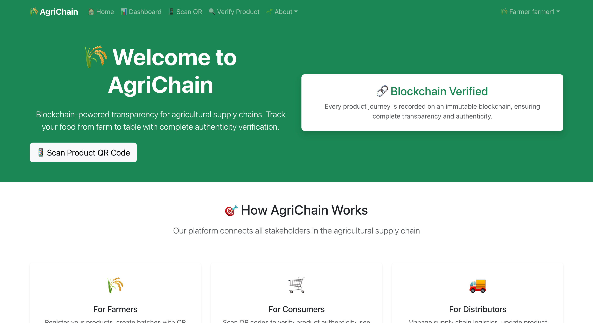
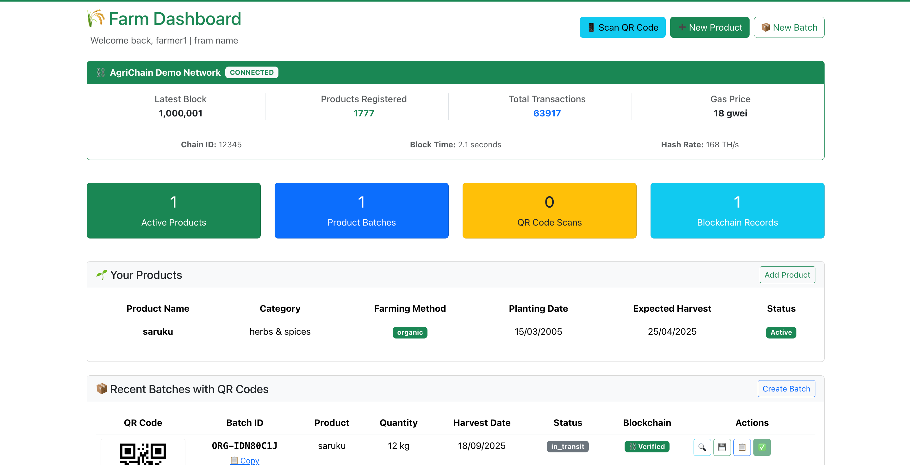
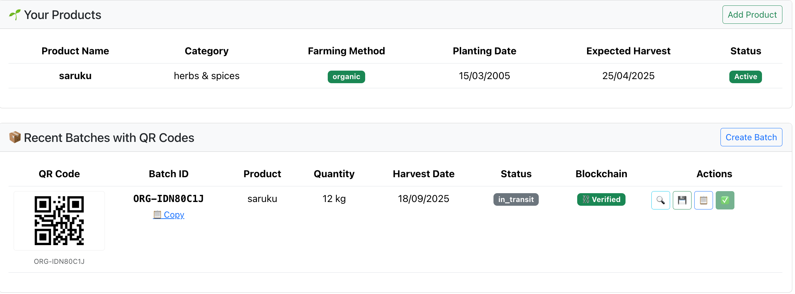
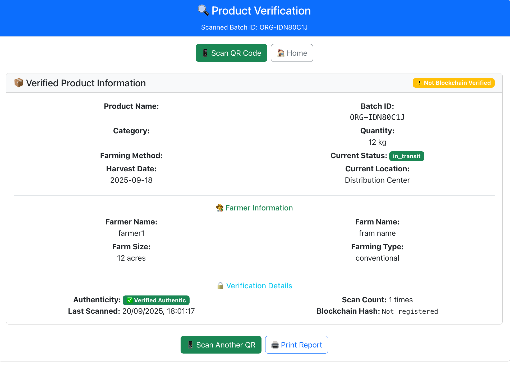
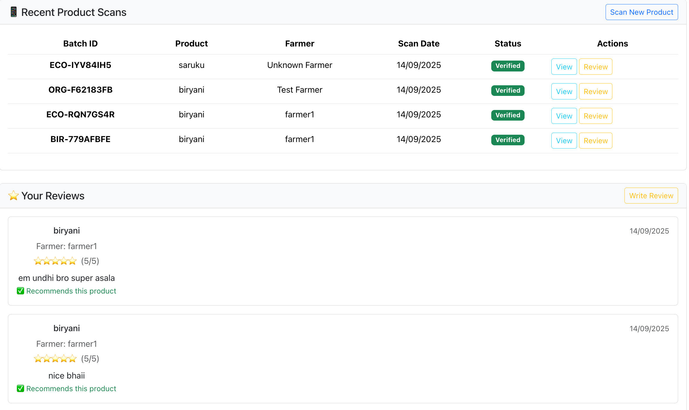
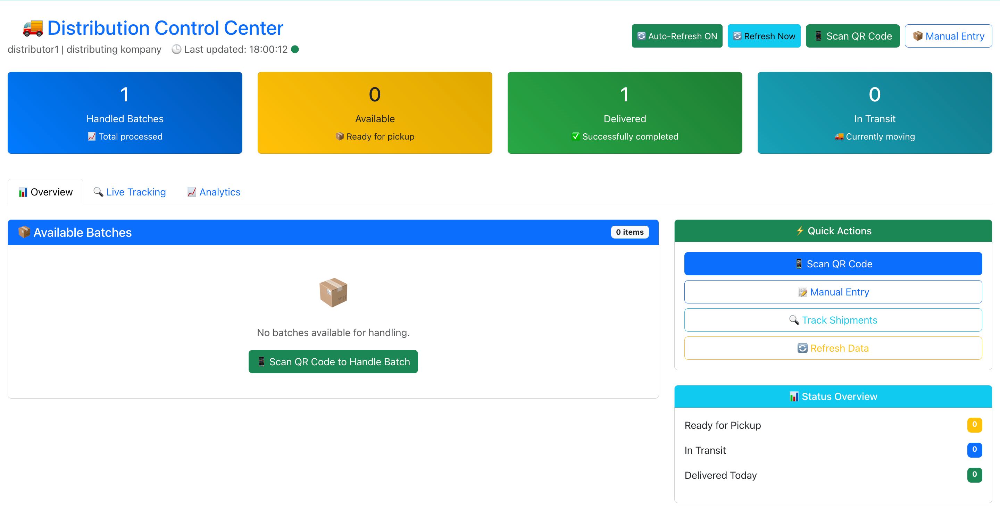

# Blockchain-Based Agriculture Supply Chain Management – Screenshots

This document showcases the major interfaces of the project.

---

## 🏠 Home
The landing page of the system with an overview of the supply chain flow.  

---

## 👨‍🌾 Farmer
Interface for farmers to register produce and add details securely on the blockchain.  

---

## 🔗 QR Generator
Generates unique QR codes for each product, enabling traceability across the supply chain.  

---

## ✅ Verification
Consumers or stakeholders can scan the QR code to verify product authenticity and history.  

---

## ⭐ Reviews
Users can add feedback and reviews to improve transparency and trust in the system.  

---

## 🚚 Distributor
Interface for distributors to track, update, and manage product movements in the chain.  

